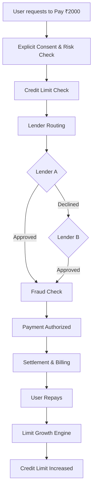
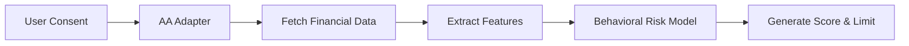

# Super.money: Consumption Credit Platform

A next-generation consumption credit application designed to underwrite both traditional and "thin-file" (new-to-credit) users. By leveraging the Account Aggregator (AA) ecosystem, it dynamically scores users based on granular UPI behavioral patterns to instantly provision credit lines.

---

### 🏗️ System Architecture

### 1. User & Experience Layer
- **User Interface**: React + Vite Frontend
- **Modules**: Dashboard, Credit Health, Pay, Transactions, Bills, Account Aggregator (AA) Consent, Security.

### 2. API & Orchestration Layer
- **Gateway**: API Gateway / REST API handling Authentication & Authorization.
- **Orchestrator**: The central **Credit Orchestrator** routes requests to specific microservices.

### 3. Core Credit Services
The Orchestrator coordinates with 11 core modular services:
1. Consent Service
2. Risk Engine
3. Credit Line Manager
4. Lender Router
5. Payment / Transaction Service
6. Settlement Service
7. Billing Service
8. Repayment Service
9. Limit Growth Engine
10. Fraud Guard
11. Audit Service

### 4. External / Integration Adapters
- **Account Aggregator Adapter**: Connects to the Mock AA/Sandbox to fetch Synthetic Financial Data.
- **Lending Adapter**: An OCEN-Compatible adapter connecting to a Simulated Lending Network (Lender A, Lender B, Lender C).

### 5. Data & Infrastructure Layer
- **Primary Database**: PostgreSQL (Users, CreditLines, Transactions, Consents, Bills, Repayments, RiskAssessments, AuditLogs).
- **Risk Data**: ML / Risk Model for Behavioral Risk Scoring.
- **Cache**: Redis for fast operations and idempotency.

---

## 🛤️ End-to-End Transaction Flow

1. **Initiation**: User wants to pay ₹2,000 and selects their 'Credit Line'.
2. **Verification**: The system performs an Explicit Consent Check and Behavioral Risk Check.
3. **Approval**: The Credit Limit / Exposure Check confirms available balance.
4. **Routing**: The Lender Router directs the request (e.g., if Lender A declines, it falls back to Lender B).
5. **Execution**: Fraud / Constraint Check passes, Payment is Authorized, and Settlement occurs.
6. **Lifecycle**: The Transaction is Recorded, a Unified Bill is Generated, and the User Repays.
7. **Growth**: The Limit Growth Engine evaluates the on-time repayment behavior and automatically increases the credit limit.



---

## 🧠 Account Aggregator & Risk Flow

1. **Consent**: User grants Explicit Consent via the AA flow.
2. **Data Fetching**: The Account Aggregator Adapter fetches Synthetic Financial Data.
3. **Feature Extraction**: The Risk Engine extracts key financial features (Income Stability, Spending Pattern, Bill Regularity, Avg Balance, Failed Txn Rate).
4. **Scoring**: The Behavioral Risk Engine computes a final Risk Score (e.g., 82/100).
5. **Decision**: The system outputs a Recommended Limit (e.g., ₹5,000).



> **SOLID • Interface-Driven • Consent-First • Audit-Ready • Fail-Closed**
> *Every rupee moved is consented, risk-checked, traceable, and governed by a single credit policy.*

---

## 🛤️ Step-by-Step Application Flow

This section details exactly how the application functions from a user's perspective, step-by-step.

### Step 1: Next-Gen Onboarding & KYC
*   The user enters their basic details (Name, DOB, PAN, Employment, Income, VPA/UPI ID).
*   **Live KYC**: The app requests camera access for a live facial scan and simulates a biometric fingerprint scan to verify identity against PAN records.

### Step 2: CIBIL Bureau Check
*   The system performs a mock check against traditional credit bureaus using the provided PAN and VPA.
*   **Prime Path**: If the user has a good score (600+), they immediately proceed to lender selection.
*   **Thin-File Path**: If no score is found (e.g., using test ID `thin@ybl`), they are flagged as new-to-credit and routed to the Alternative Underwriting path.

### Step 3: Account Aggregator (AA) Discovery & Consent (Thin-File Only)
*   The system discovers bank accounts linked to the user's mobile number/VPA.
*   The user reviews a strict consent mandate (specifying data requested, purpose, and duration) and grants the Account Aggregator permission to share their financial data with our backend.

### Step 4: 9-Signal Behavioral Risk Assessment
*   The backend's **Dynamic Risk Engine** ingests the raw transaction ledger.
*   It analyzes 9 specific quantitative signals:
    1. Transaction Frequency
    2. Transaction Consistency
    3. Bill Payment Regularity
    4. Category Diversity
    5. Average Transaction Value
    6. Cash-Flow Inflows
    7. Cash-Flow Stability
    8. Failed Transaction Rate
    9. Platform Repayments
*   It computes a final **Behavioral Score** (out of 1000) and assigns a Risk Tier (e.g., Low Risk).

### Step 5: Lenders Marketplace & Provisioning
*   Based on the computed Behavioral Score, the user unlocks a specific limit tier (e.g., ₹5,000, ₹10,000, or ₹20,000).
*   The **Lenders Marketplace** dynamically fetches offers from Partner NBFCs (like Bajaj Finserv, Tata Capital) matching that limit.
*   The user selects an offer, accepts the T&Cs, and the credit line is instantly provisioned.

### Step 6: Unified Dashboard & Credit Health
*   The user lands on the Dashboard where they can manage their new credit line, pay bills, and view transactions.
*   The **Credit Health** module provides deep transparency:
    *   Shows the exact breakdown of their 9-Signal Score with progress bars.
    *   Displays their Raw UPI Payment History used in the assessment.

---

## 💻 Tech Stack

### Frontend (`/frontend`)
*   **Core**: React 18, TypeScript, Vite
*   **Styling**: Tailwind CSS (with Lucide React icons)
*   **State Management**: React Context API
*   **Routing**: React Router v6

### Backend (`/backend`)
*   **Core**: Node.js, Express, TypeScript
*   **Architecture**: Layered architecture (Controllers, Services, Routes)
*   **Modules**: Mock AA implementation, Rule Engine, and API mock servers.

---

## 🛠️ Local Development Setup

To run the full stack locally:

1. **Start the Backend:**
   ```bash
   cd backend
   npm install
   npm run dev
   # Runs on http://localhost:3000
   ```

2. **Start the Frontend:**
   Open a new terminal window:
   ```bash
   cd frontend
   npm install
   npm run dev
   # Runs on http://localhost:5173
   ```

## 🧪 Testing Personas
Use these VPA/UPI IDs during Step 1 to trigger different app behaviors:
*   `thin@ybl`: Triggers the successful thin-file AA path (High Behavioral Score).
*   `thin-fail@ybl`: Triggers the rejected thin-file AA path (Poor UPI Behavior).
*   `existing@super.money`: Skips AA and triggers the standard Prime bureau path.
