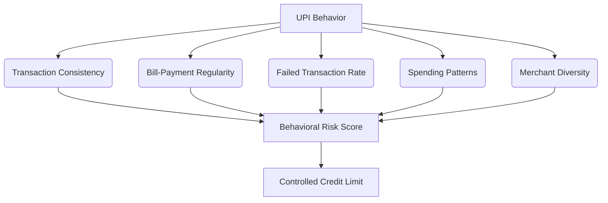

# ConsumptionCredit

**A simulated "Credit Line on UPI" orchestration platform.**

## The Core Thesis

At first glance, this might look like a credit card app. **It is not.**

We are not building a payments app. We are building the **credit orchestration layer** that sits behind a UPI-style payment: risk scoring, consent, multi-lender routing, billing, and fraud-safe settlement.

### Traditional Credit Card vs. ConsumptionCredit

| Feature | Traditional Credit Card | ConsumptionCredit |
| :--- | :--- | :--- |
| **Medium** | Credit is attached to a physical/virtual card | Credit is attached to a UPI-style credit line |
| **Rails** | Card-based payment networks (Visa/MC) | Designed around UPI-style merchant payments |
| **Underwriting**| Traditional bureau/financial data | Behavioral signals for thin-file users |
| **Lender** | Usually a single card issuer/bank | Multi-lender orchestration abstraction |
| **Transparency**| Usage seen post-purchase in statements | "Own Money vs Credit" shown directly during payment |
| **Credit Limit**| Fixed limits governed by issuer rules | Dynamic limit growth based on repayment behavior |
| **Product Focus**| The card is the main product | The **credit orchestration layer** is the main product |

## The Differentiator: The "Thin-File" Problem

Suppose two users want a ₹5,000 credit limit:

*   **User A (Traditional):** Has a CIBIL history → Traditional underwriting makes a decision.
*   **User B (Thin-file):** Has little/no history → Traditional system knows less → Cold-start problem.

**ConsumptionCredit solves User B's problem.**
If we don't have enough bureau history, we use responsible transaction behavior as an additional signal:



## The System Architecture

Instead of `User → Card → Card Network → Issuer`, ConsumptionCredit orchestrates a dynamic lifecycle:

```
UPI-style Payment Request
       ↓
[ ConsumptionCredit Core ]
 ┌─────┼──────┬─────────┐
Risk  Consent  Lender  Settlement
       │
       ↓
    Billing
       ↓
   Repayment
       ↓
 Limit Growth
```

The credit itself isn't revolutionary. The interesting part is the **orchestration + thin-file risk + transparency + dynamic credit lifecycle.**
